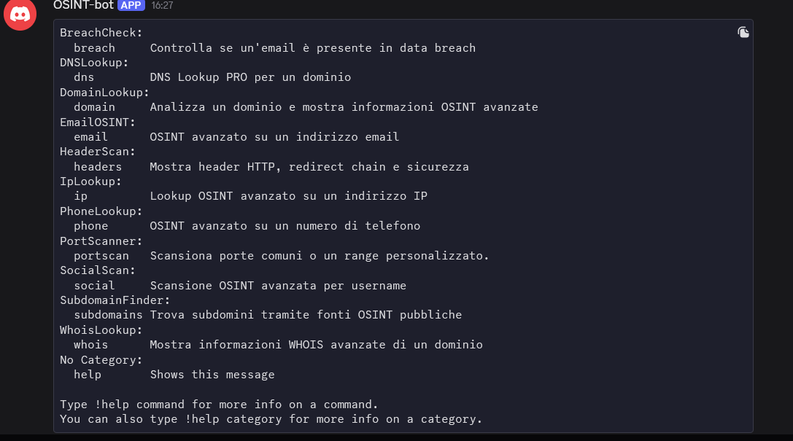

#  OSINT Discord Bot

A modular, asynchronous Discord bot built in Python for Open Source Intelligence (OSINT) and cybersecurity recon tasks.  
Designed for fast, reliable information gathering across domains, IPs, emails, usernames, and more.


## Features

This bot includes a full suite of OSINT commands:

| Command     | Description 
|-------------|--------------------------------------------------
| `!ip`       | Lookup information about an IP address (location, ASN, ISP, etc.) 
| `!domain`   | Analyze a domain and retrieve OSINT data 
| `!breach`   | Check if an email has appeared in known data breaches 
| `!headers`  | Scan HTTP headers of a website 
| `!phone`    | Analyze a phone number (country, carrier, type)
| `!portscan` | Scan common or custom ports and grab service banners 
| `!social`   | Check if a username exists on major social platforms 
| `!whois`    | Retrieve WHOIS information for a domain 
| `!help`     | Show all available commands and categories 


## Screenshot



---

## Technologies Used

- Python 3.11+
- Discord.py (nextcord or py-cord compatible)
- aiohttp (async HTTP requests)
- phonenumbers (phone analysis)
- python-whois (WHOIS lookup)
- asyncio + socket (port scanning)
- LeakCheck.io (public API for breach check)


##  Why I Built This

As a cybersecurity student and self-taught developer, I wanted a tool that could:

- Help me practice OSINT workflows
- Automate recon tasks in Discord
- Showcase my skills in Python, networking, and bot development
- Serve as a real-world project for my portfolio and LinkedIn

---

## 📦 Installation

```bash
git clone https://github.com/terminalkid09/osint-bot
cd osint-bot
pip install -r requirements.txt
python bot.py
```

**@Terminalkid09**